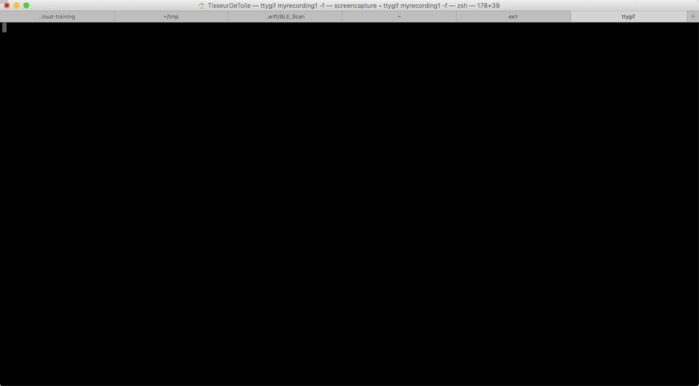

[](https://www.travis-ci.org/tisseurdetoile/BLE_Scan)


# BLE_Scan
A quick and dirty App that scan all nearby BLE device in terminal for OSX (written in swift)

Tested on Macbook in OSX 10.12.6

Work with :
   - BLE Device
   - EddyStone format beacon (URL)
   - [Ruuvi tag](https://tag.ruuvi.com/)

# Install and Run
    - Download BLE_scan from the latest release
    - open terminal
    - find the folder of the downloaded BLE_scan
    - do a chmod +x ./BLE_scan
    - execute BLE_scan
    - ./BLE_scan
    - Enjoy
    - Hit Ctrl + C (when done)

## in one image    




## example output

```bash
Scanning...
BLE is now powered on
Device : E4A6C1F5-CF13-407D-B51A-F28E61C6D33F - RSSI : -57 serviceData : [Unknown (<feaa>): <10f90372 75752e76 692f2342 49675541 4d6d5145>] EddyStoneUrl : https://ruu.vi/#BIgUAMmQE 
Device : 79D87F37-8976-40FF-86EE-D9EC45869E1D - RSSI : -87 serviceData : [Unknown (<feaa>): <10ee0372 75752e76 692f2341 6f415841 4d6b73>] EddyStoneUrl : https://ruu.vi/#AoAXAMks ```
```

# BLE_Scan (En français)
Une application brouillonne qui balaye les objets Bluetooth LE proche de votre mac (écrit en swift)

Testé sur un Macbook avec OSX 10.12.6

Fonctionne avec :
   - Objets Bluetooth LE
   - Object qui emmette au format EddyStone (URL)
   - [Ruuvi tag](https://tag.ruuvi.com/)

# Installer et Utiliser
    - Télécharger le fichier BLE_scan de la dernière livraison
    - Ouvrir un terminal
    - Aller dans le dossier ou vous avez télécharger BLE_Scan
    - rendre executable en faisant chmod +x ./BLE_scan
    - éxecuter BLE_scan
    - ./BLE_scan
    - Cool
    - Hit Ctrl + C (quand vous avez finis)